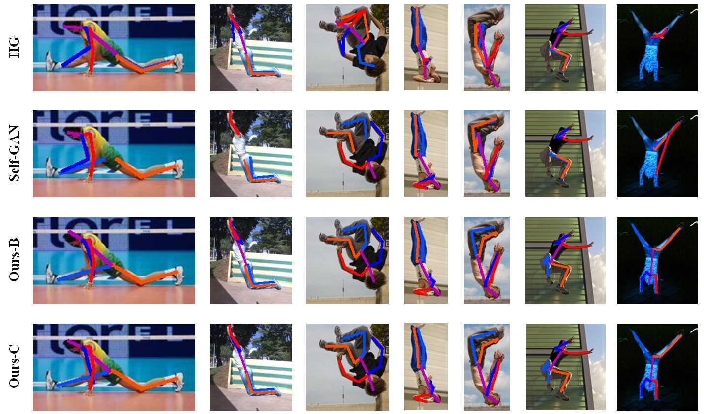

# Improving Human Pose Estimation with Self-Attention Generative Adversarial Networks

This code is based on [Learning Feature Pyramids for Human Pose Estimation](https://github.com/bearpaw/PyraNet) and [fb.resnet.torch](https://github.com/facebook/fb.resnet.torch). Thanks to the authors. 

## Install

1. Install [Torch](http://torch.ch/).

2. Install dependencies.
   ```
   luarocks install hdf5
   luarocks install matio
   luarocks install optnet
   ```

3. (Optional) Install nccl for better performance when training with multi-GPUs.
   ```
   git clone https://github.com/NVIDIA/nccl.git
   cd nccl
   make 
   make install
   luarocks install nccl
   ```
   set `LD_LIBRARY_PATH` in file `~/.bashrc` if `libnccl.so` is not found.

4. Prepare dataset.  
   Create a symbolic link to the images directory of the MPII dataset:
   ```
   ln -s PATH_TO_MPII_IMAGES_DIR data/mpii/images
   ```
   Create a symbolic link to the images directory of the LSP dataset (images are stored in `PATH_TO_LSP_DIR/images`):
   ```
   ln -s PATH_TO_LSP_DIR data/lsp/lsp_dataset
   ```
   Create a symbolic link to the images directory of the LSP extension dataset (images are stored in `PATH_TO_LSPEXT_DIR/images`):
   ```
   ln -s PATH_TO_LSPEXT_DIR data/lsp/lspet_dataset
   ```

## Training and Testing

### Quick Start

#### Testing from our pretrained model
Download our pretrained model to `./pretrained` folder from [Baidu Drive](https://drive.google.com/open?id=0B63t5HSgY4SQbmJoRV9fOTBFTlU). Test on the MPII validation set by running the following command

```
qlua main.lua -batchSize 1 -nGPU 1 -nStack 4 -minusMean true -loadModel pretrained/model_250.t7 -testOnly true -debug true
```



For multi-scale testing, run

```
qlua evalPyra.lua -batchSize 1 -nGPU 1 -nStack 4 -minusMean true -loadModel pretrained/model_250.t7 -testOnly true -debug true
```

**Note**: 
* If you DO NOT want to visualize the training results. Set `-debug false` and use `th` instead of `qlua`.
* you may set the number of scales in `evalPyra.lua` (Line 22 ). Use fewer number of scales or multiple GPUs if "out of memory" occurs.
* use `-loadModel MODEL_PATH` to load a specific model for testing or training

#### Train a two-stack hourglass model 

Train an example two-stack hourglass model on the MPII dataset with the proposed script.

```
sh ./experiments/mpii/hg-prm-stack2.sh 
```

### Customize your own training and testing procedure

A sample script for training on the MPII dataset with 4-stack hourglass model.

```bash
#!/usr/bin/env sh
expID=mpii/hg_atten   # snapshots and log file will save in checkpoints/$expID
dataset=mpii          # mpii | mpii-lsp | lsp |
gpuID=0,1             # GPUs visible to program
nGPU=2                # how many GPUs will be used to train the model
batchSize=6          
LR=2.5e-4
netType=hg-atten        # network architecture
nStack=4
nResidual=2
nThreads=8            # how many threads will be used to load data
minusMean=true
nClasses=16
nEpochs=250           
snapshot=2           # save models for every $snapshot
nFeats=256

OMP_NUM_THREADS=1 CUDA_VISIBLE_DEVICES=$gpuID th main.lua \
   -dataset $dataset \
   -expID $expID \
   -batchSize $batchSize \
   -nGPU $nGPU \
   -LR $LR \
   -momentum 0.0 \
   -weightDecay 0.0 \
   -netType $netType \
   -nStack $nStack \
   -nResidual $nResidual \
   -nThreads $nThreads \
   -minusMean $minusMean \
   -nClasses $nClasses \
   -nEpochs $nEpochs \
   -snapshot $snapshot \
   -nFeats $nFeats \
   # -resume checkpoints/$expID  \  # uncomment this line to resume training
   # -testOnly true \               # uncomment this line to test on validation data
   # -testRelease true \            # uncomment this line to test on test data (MPII dataset)
```


## Evaluation
You may evaluate the PCKh score of your model on the MPII validation set. To get start, download our prediction `pred_multiscale_250.h5` to `./pretrained` from [Google Drive](https://drive.google.com/open?id=0B63t5HSgY4SQbmJoRV9fOTBFTlU), and run the MATLAB script `evaluation/eval_PCKh.m`. You'll get the following results

```
      Head , Shoulder , Elbow , Wrist , Hip , Knee  , Ankle , Mean , 
name , 98.3 , 95.1 , 92.6 , 89.8 , 94.6 , 95.0 , 94.5 , 94.3
```
